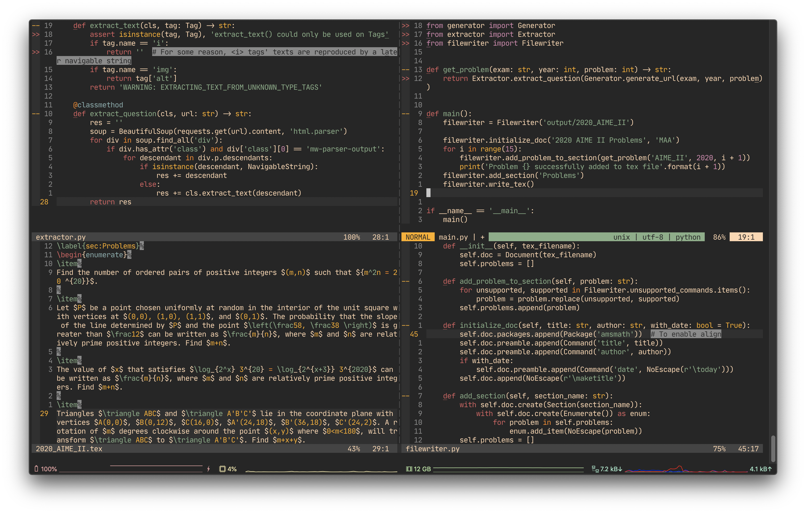
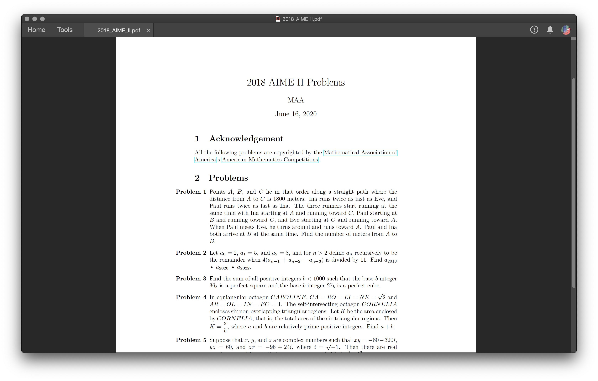

# AMC Worksheet Generator

AWG generates worksheets consisting of problems from [past AMC exams](https://artofproblemsolving.com/wiki/index.php/AMC_Problems_and_Solutions) for **personal practice** purposes.

## Screenshots

## Mechanism

AWG uses [Requests](https://requests.readthedocs.io/en/master/) and [BeautifulSoup4](https://www.crummy.com/software/BeautifulSoup/bs4/doc/) to extract individual problems (text with formulas and diagrams) from [AOPS](https://artofproblemsolving.com/wiki/index.php/AMC_Problems_and_Solutions). It then writes the problems into a LaTeX file and exports it to a PDF using [PyLaTeX](https://jeltef.github.io/PyLaTeX/current/).

## Supported Exams

|AMC 8|AMC 10|AMC 12|AIME|
|:---:|:---:|:---:|:---:|
|AMC_8|AMC 10|AMC 12|AIME|
||AMC 10A|AMC 12A|AIME I|
||AMC 10B|AMC 12B|AIME II|
